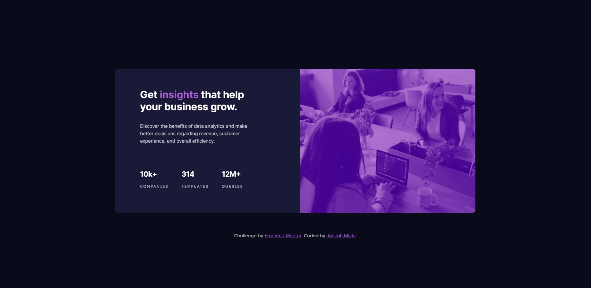

# Frontend Mentor - Stats preview card component solution

This is a solution to the [Stats preview card component challenge on Frontend Mentor](https://www.frontendmentor.io/challenges/stats-preview-card-component-8JqbgoU62). Frontend Mentor challenges help you improve your coding skills by building realistic projects. 

## Table of contents

- [Overview](#overview)
  - [The challenge](#the-challenge)
  - [Screenshot](#screenshot)
  - [Links](#links)
- [My process](#my-process)
  - [Built with](#built-with)
  - [What I learned](#what-i-learned)
  - [Continued development](#continued-development)
  - [Useful resources](#useful-resources)
- [Author](#author)

## Overview

### The challenge

Users should be able to:

- View the optimal layout depending on their device's screen size

### Screenshot



### Links

- Solution URL: [On frontend.io](https://www.frontendmentor.io/solutions/responsive-site-made-using-sass-ErPfe66xP)
- Live Site URL: [Github Pages](https://joemics.github.io/frontend-mentor-stats-preview-card-component/)

## My process

### Built with

- Semantic HTML5 markup
- Flexbox
- Mobile-first workflow

### What I learned
In the following code snippet, I was able to use the HTML picture tag to show different image files depending on the screen size:

```html
      <picture class="preview-card__photo">
        <source
          media="(min-width: 1440px)"
          srcset="./images/image-header-desktop.jpg"
        />
        <source
          media="(max-width: 1440px)"
          srcset="./images/image-header-mobile.jpg"
        />
        
      </picture>
```

The most challenging part of this project was being able to put an overlay on top of a black and white image. Here I'm able to use the ::after pseudo-element to create a translucent layer. This is combined with mix-blend-mode, and filter: 
```scss
.preview-card__photo {
  height: 100%;
  width: auto;
  position: relative;
  flex: 0 1 auto;

  img {
    height: 100%;
    width: 100%;
    filter: brightness(0.6);
  }

  &::after {
    content: "";
    position: absolute;
    left: 0;
    top: 0;
    right: 0;
    bottom: 0;
    background-color: $primary-soft-violet;
    opacity: 0.78;
    mix-blend-mode: hard-light;
  }
}
}
```

### Continued development

This is the first project in which I was able to utilize a mobile-first workflow. I found it's much easier and faster to write the CSS for the simpler mobile design, and then add complexity as the screen size got bigger. It's also my first time using media queries. 

In the future I would like to better be able to organize my code so it is more maintanable, and have a better understanding of which CSS units to use. For example, I should have considered using ch units for the text in the preview card. 

### Useful resources

- [Use CSS ::before and ::after for simple, spicy image overlays](https://bryanlrobinson.com/blog/how-to-css-after-elements-for-background-overlays/) - I used the information in this article to help create the overlay on top of the black and white image.

- [Before and After pseudo elements explained - part one: how they work](https://www.youtube.com/watch?v=zGiirUiWslI) - This is an amazing video by Kevin Powell which helped clear the confusion about ::before and ::after. I will personally be referring to this video often.


## Author

- Frontend Mentor - [@JoeMics](https://www.frontendmentor.io/profile/JoeMics)


